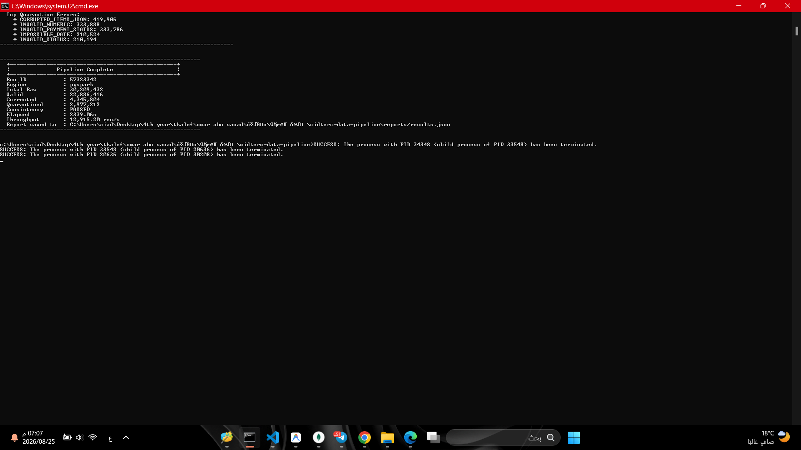
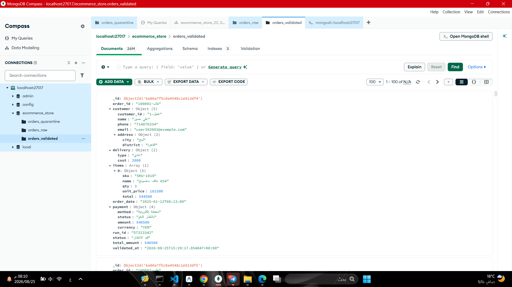
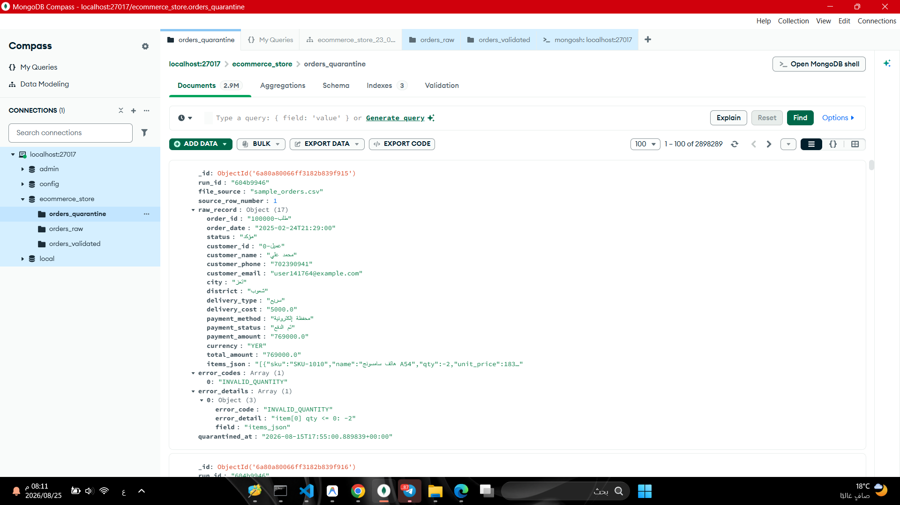
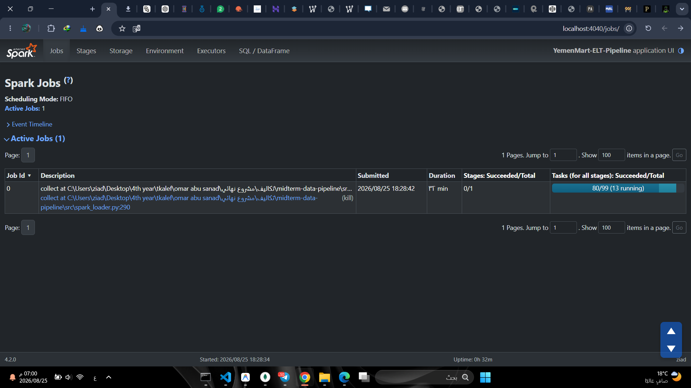

# مشروع خط البيانات الهجين (Hybrid ELT Data Pipeline)
### معالجة وتدقيق بيانات طلبات التجارة الإلكترونية الضخمة (E-Commerce Big Data)

---

> **المقرر:** البيانات الضخمة (العملي) — Big Data (Practical)  
> **الجامعة:** جامعة الرازي — Al-Razi University  
> **إشراف:** م. عمر أبو سند (Eng. Omar Abu Sanad)  
> **إعداد الطالب:** زياد (Ziad)  

---

## 📑 الفهرس | Table of Contents
- [نبذة عن المشروع | Overview](#-نبذة-عن-المشروع--overview)
- [الميزات الرئيسية | Key Features](#-الميزات-الرئيسية--key-features)
- [المتطلبات الأساسية | Prerequisites](#-المتطلبات-الأساسية--prerequisites)
- [خطوات التثبيت والإعداد | Installation & Setup](#-خطوات-التثبيت-والإعداد--installation--setup)
- [دليل التشغيل السريع | Quick Start Guide](#-دليل-التشغيل-السريع--quick-start-guide)
- [هيكل المشروع | Project Structure](#-هيكل-المشروع--project-structure)
- [مجموعات قاعدة البيانات | MongoDB Collections](#-مجموعات-قاعدة-البيانات--mongodb-collections)
- [آلية عدم التكرار | Idempotency Mechanism](#-آلية-عدم-التكرار--idempotency-mechanism)
- [تشغيل الاختبارات الآلية | Running Tests](#-تشغيل-الاختبارات-الآلية--running-tests)
- [معرض لقطات الشاشة | Screenshots Section](#-معرض-لقطات-الشاشة--screenshots-section)

---

## 📖 نبذة عن المشروع | Overview

**مشروع خط البيانات الهجين (Hybrid ELT Data Pipeline)** هو نظام متكامل مصمم لمعالجة وتدقيق وتحميل بيانات طلبات التجارة الإلكترونية اليمنية غير المنتظمة وذات الجودة المتفاوتة (Messy & Mixed-Quality Data). 

يتبنى المشروع نمط **ELT (Extract - Load - Transform)** الحديث؛ حيث يتم استخراج وحفظ البيانات الأولية كما هي بدون أي تعديل في مستودع البيانات الخام، ثم تطبيق محرك تدقيق وتنظيف فائق الذكاء يطبق 10 قواعد تنظيف متخصصة لدعم البيانات العربية، وتصنيف السجلات إلى ثلاث فئات: **سليمة (Valid)**، **مصححة مع سجل تدقيق (Corrected with Audit Trail)**، أو **معزولة (Quarantined)** مع توثيق أسباب العزل بدقة.

### المحرك الهجين الذكي (Hybrid Engine):
- 🔹 **Python Batch Streaming Loader:** مخصص للملفات الصغيرة والمتوسطة ($\le 200\text{ MB}$)، يعتمد على القراءة التدفقية السطرية لتوفير استهلاك الذاكرة العشوائية (RAM).
- 🔹 **PySpark Parallel Loader:** مخصص للملفات الكبيرة والضخمة ($> 200\text{ MB}$)، يستغل قدرات المعالجة الموزعة والتوازي العالي للأنوية المتعددة.

---

## ✨ الميزات الرئيسية | Key Features

1. **توجيه ديناميكي ذكي (Smart File Routing):** فحص حجم الملف تلقائياً واختيار المحرك الأمثل للمعالجة دون تدخل يدوي.
2. **استهلاك ذاكرة منخفض وثابت (O(1) Memory Streaming):** قراءة تدفقية للملفات تضمن عدم حدوث تجاوز لذاكرة النظام (Out-Of-Memory).
3. **دعم استثنائي للغة العربية والبيانات المحلية:**
   - معالجة الأرقام المشرقية العربية (`٠-٩`) والفواصل العربية (`٫`, `٬`).
   - توحيد العملة المحلية وتصحيح المسميات المختلفة للريال اليمني (`YER`).
   - تحويل الكلمات العربية الدالة على المبالغ إلى أرقام (مثل: *ألفان* $\rightarrow 2000$).
   - تدقيق وتصحيح أرقام الهواتف النقالة لشبكات الاتصالات اليمنية (سبأفون، يمن موبايل، يو، واي).
4. **سجل تدقيق كامل للتحولات (Full Audit Trail):** كل تصحيح يتم توثيقه داخل السجل موضحاً الحقل، القيمة الأصلية، القيمة المصححة، والقاعدة المطبقة.
5. **معادلة اتساق رياضية صارمة (Mathematical Consistency):**
   $$\text{Total Raw} = \text{Valid} + \text{Corrected} + \text{Quarantined}$$
6. **معالجة تكرارية آمنة (Idempotent Execution):** إمكانية إعادة تشغيل الملف عدة مرات بأمان تام بفضل تقنية `UpdateOne(..., upsert=True)`.
7. **تقارير أداء شاملة:** توليد تلقائي لتقارير التنفيذ بصيغتي `JSON` و `Markdown` مع قياس السرعة، استهلاك الذاكرة، ومعدل السجلات/ثانية.

---

## 🛠️ المتطلبات الأساسية | Prerequisites

قبل البدء في تشغيل المشروع، تأكد من توفر الأدوات والبرمجيات التالية على جهازك:

| المتطلب / Software | الإصدار الأدنى / Minimum Version | الغرض / Purpose |
| :--- | :--- | :--- |
| **Python** | `3.11+` (64-bit) | لغة البرمجة الأساسية لتشغيل خط البيانات |
| **Java JDK** | `17+` (OpenJDK أو Oracle JDK) | متطلب أساسي لتشغيل محرك Apache Spark / PySpark |
| **MongoDB Server** | `6.0+` أو `7.0+` (Community Server) | قاعدة البيانات الموجهة للمستندات (Document Database) |
| **MongoDB Compass** *(اختياري)* | أحدث إصدار | واجهة رسومية لمعاينة المجموعات والفهارس |

> [!NOTE]
> تأكد من تشغيل خدمة MongoDB محلياً على المنفذ الافتراضي `mongodb://localhost:27017` والتأكد من ضبط متغير البيئة `JAVA_HOME` لمسار تثبيت Java JDK.

---

## 📥 خطوات التثبيت والإعداد | Installation & Setup

### 1. استنساخ أو الانتقال لمجلد المشروع (Clone / Navigate)
```bash
cd "c:\Users\ziad\Desktop\4th year\tkalef\omar abu sanad\تكاليف\مشروع نهائي\midterm-data-pipeline"
```

### 2. إنشاء وتفعيل البيئة الافتراضية (Virtual Environment)
```powershell
# في نظام Windows عبر PowerShell:
python -m venv venv
.\venv\Scripts\Activate.ps1
```

### 3. تثبيت المكتبات والمتطلبات (Install Dependencies)
```bash
pip install -r requirements.txt
```

محتويات ملف `requirements.txt`:
- `pymongo>=4.6`
- `pyspark>=3.5`
- `psutil>=5.9`
- `pytest>=8.0`
- `streamlit>=1.30`
- `plotly>=5.18`
- `pandas>=2.0`

---

## 🚀 دليل التشغيل السريع | Quick Start Guide

### الخطوة 1: استخراج عينة صغيرة من البيانات (اختياري)
إذا كان لديك ملف بيانات ضخم وتريد تجربة خط البيانات على عينة سريعة (مثلاً 50,000 سجل):
```bash
python src/create_small_sample.py --input "data/orders_huge_mixed_quality.csv" --output "data/sample_orders.csv" --rows 50000
```

### الخطوة 2: تشغيل خط معالجة البيانات (Run ELT Pipeline)
قم بتمرير مسار ملف البيانات المراد معالجته عبر معامل `--input`:

```bash
# تشغيل على ملف العينة (سيوجه تلقائياً إلى Python Batch Loader):
python src/main.py --input "data/sample_orders.csv"

# تشغيل على ملف البيانات الضخم (سيوجه تلقائياً إلى PySpark Parallel Loader):
python src/main.py --input "data/orders_huge_mixed_quality.csv"
```

### الخطوة 3: معاينة التقارير الناتجة (View Reports)
بعد انتهاء المعالجة بنجاح، ستجد التقارير مفصلة داخل مجلد `reports/`:
- `reports/results.json`: بيانات رقمية متكاملة لجميع المقاييس والأخطاء.
- `reports/results.md`: تقرير منسق وجداول مقارنة ومؤشرات أداء.

---

## 📂 هيكل المشروع | Project Structure

```text
midterm-data-pipeline/
│
├── config/
│   ├── __init__.py
│   └── settings.py              # الإعدادات العامة، الثوابت، وقواعد الأعمال
│
├── dashboard/
│   └── app.py                   # لوحة التحكم التفاعلية (Streamlit + Plotly)
│
├── data/
│   ├── sample_orders.csv        # ملف عينة لاختبارات التطوير والتشغيل السريع
│   └── orders_huge_mixed_quality.csv  # ملف البيانات الضخم
│
├── docs/
│   └── architecture.md          # وثيقة معمارية النظام التفصيلية وتصميم المكونات
│
├── reports/
│   ├── results.json             # تقرير التنفيذ بصيغة JSON
│   ├── results.md               # تقرير التنفيذ بصيغة Markdown
│   ├── benchmark_results.json   # نتائج مقارنة أداء Python Batch و PySpark
│   └── screenshots/             # مجلد مخصص للقطات الشاشة التوثيقية
│
├── src/
│   ├── __init__.py
│   ├── batch_loader.py          # محرك التدفق والدفعات (Python Batch Streaming)
│   ├── benchmark.py             # أداة مقارنة الأداء بين Python Batch و PySpark
│   ├── compare_with_clean.py    # مقارنة المخرجات مع ملف البيانات النظيف
│   ├── create_small_sample.py   # أداة استخراج عينات البيانات التدفقية
│   ├── elt_pipeline.py          # منسق خط البيانات وإدارة دورة الحياة (Orchestrator)
│   ├── file_router.py           # موجه الملفات وتحديد المحرك المناسب بناءً على الحجم
│   ├── main.py                  # نقطة الدخول الرئيسية للبرنامج (CLI Entrypoint)
│   ├── metrics.py               # متتبع مؤشرات الأداء والاتساق وتوليد التقارير
│   ├── mongo_setup.py           # تهيئة قاعدة البيانات والفهارس وقواعد التحقق
│   ├── quality_rules.py         # محرك قواعد التنظيف العشر والتدقيق
│   ├── spark_analyzer.py        # أداة تحليل الملفات الضخمة بـ PySpark
│   └── spark_loader.py          # محرك المعالجة المتوازية (PySpark Distributed)
│
├── tests/
│   ├── __init__.py
│   ├── test_cleaning_rules.py   # اختبارات الوحدة لقواعد التنظيف الـ 10
│   └── test_classification.py   # اختبارات التكامل والتصنيف والبنية وعدم التكرار
│
├── run_dashboard.bat            # سكريبت تشغيل لوحة التحكم التفاعلية
├── requirements.txt             # حزم ومكتبات بايثون المطلوبة
└── README.md                    # دليل المشروع الرئيسي
```

---

## 🗄️ مجموعات قاعدة البيانات | MongoDB Collections

يستخدم المشروع قاعدة بيانات باسم **`ecommerce_store`**، وتتضمن ثلاث مجموعات رئيسية منظمة وفق أفضل ممارسات بحيرات ومستودعات البيانات (Data Lakehouse Architecture):

```
                        ┌────────────────────────┐
                        │   orders_raw           │ ──> حفظ كل السجلات الأصلية كما هي
                        └──────────┬─────────────┘
                                   │
                    [ تطبيق قواعد التدقيق الـ 10 ]
                                   │
                  ┌────────────────┴────────────────┐
                  ▼                                 ▼
       ┌──────────────────────┐          ┌──────────────────────┐
       │  orders_validated    │          │  orders_quarantine   │
       │  (سليمة ومصححة)      │          │  (معزولة لوجود أخطاء) │
       └──────────────────────┘          └──────────────────────┘
```

1. **مجموعة السجلات الخام (`orders_raw`):**
   - تستقبل جميع السجلات المدخلة كما هي دون أي حذف أو تشويه.
   - تحتوي على بيانات وصفية لتتبع المصدر: `run_id`, `file_source`, `source_row_number`, `ingested_at`, `engine_used`.
2. **مجموعة السجلات السليمة والمصححة (`orders_validated`):**
   - تخزن المستندات المنظفة والمطابقة لنموذج البيانات المتفرع (Nested JSON Schema).
   - تحتوي على الفهارس الفريدة لمنع التكرار (`unique index on order_id`).
   - في حال تعديل أي حقل، يتم إرفاق مصفوفة `corrections` (Audit Trail) التي توثق التغييرات.
3. **مجموعة السجلات المعزولة (`orders_quarantine`):**
   - مخصصة للسجلات التي تحتوي على أخطاء جسيمة غير قابلة للإصلاح التلقائي (مثل: غياب معرف الطلب أو العميل، مبالغ برمز `???`، أو كميات سالبة).
   - توثق السجل الخام مع مصفوفة أكواد الأخطاء `error_codes` وقائمة التفاصيل `error_details`.

---

## 🔁 آلية عدم التكرار | Idempotency Mechanism

تعتبر خاصية **Idempotency** إحدى أهم ركائز خطوط البيانات الاحترافية؛ وتعني القدرة على إعادة تشغيل خط الأنابيب على نفس ملف البيانات عدة مرات دون إنتاج سجلات مكررة أو التسبب في أخطاء تكرار المفاتيح.

### كيف يحقق النظام هذه الخاصية؟
1. **الفهرس الفريد (Unique Index):** تم تطبيق فهرس فريد على حقل `order_id` في مجموعة `orders_validated`.
2. **عملية الدمج والتحديث (`UpdateOne` مع `upsert=True`):**
   ```python
   UpdateOne(
       {"order_id": doc["order_id"]},  # البحث عن الطلب
       {"$set": doc},                  # تحديث جميع الحقول
       upsert=True                     # إدخال إذا لم يكن موجوداً
   )
   ```
3. **النتيجة:**
   - عند التشغيل لأول مرة: يتم إدخال السجلات الجديدة (`upserted_count`).
   - عند إعادة التشغيل بنفس البيانات: يتم مطابقة السجلات وتحديثها بدون تكرار أو زيادة في العدد الإجمالي.

---

## 🧪 تشغيل الاختبارات الآلية | Running Tests

تم بناء حزمة اختبارات شاملة بالاعتماد على إطار عمل `pytest` لتغطية جميع قواعد التنظيف العشر، حالات الحافة (Edge Cases)، والتصنيف السليم:

```bash
# تشغيل جميع الاختبارات مع إظهار التفاصيل:
pytest tests/ -v

# تشغيل اختبارات قواعد التنظيف فقط:
pytest tests/test_cleaning_rules.py -v

# تشغيل اختبارات التصنيف وهيكل المستندات:
pytest tests/test_classification.py -v
```

---

## 📸 معرض لقطات الشاشة | Screenshots Section

> سيتم إدراج لقطات الشاشة التنفيذية للمشروع في هذا القسم:

### 1. مخرجات تشغيل خط البيانات في موجه الأوامر (Console Output)

*صورة توضح مراحل التنفيذ، الفحص التلقائي، وملخص مؤشرات الأداء النهائي.*

### 2. معاينة مجموعة السجلات السليمة في MongoDB Compass (`orders_validated`)

*صورة توضح الهيكل المتفرع للمستندات ومصفوفة التدقيق `corrections`.*

### 3. معاينة مجموعة السجلات المعزولة في MongoDB Compass (`orders_quarantine`)

*صورة توضح السجلات المعزولة وقائمة أكواد الأخطاء `error_codes`.*

### 4. واجهة مراقبة مهام PySpark (Spark UI)

*صورة توضح التوازي وتوزيع الأنوية والمهام أثناء معالجة الملفات الضخمة.*

---

<div align="center">
  <b>تم بحمد الله وتوفيقه</b><br>
  مقرر البيانات الضخمة | جامعة الرازي | 2026
</div>
